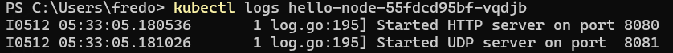
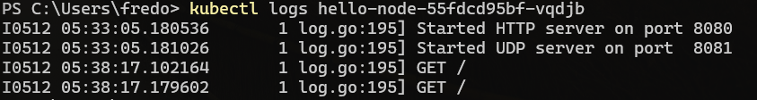

## Refleksi Modul 11 Adpro

1. **Compare the application logs before and after you exposed it as a Service. Try to open the app several times while the proxy into the Service is running. What do you see in the logs? Does the number of logs increase each time you open the app?**

Ya, terdapat perubahan yakni setelah meng-expose service, tiap request GET akan tercatat pada log. Setiap kali saya membuka aplikasi log tersebut akan bertambah
Screenshoot perbedaan application logs sebelum dan setelah `kubectl service hello-node`:
Before:

After:

2. **Notice that there are two versions of `kubectl get` invocation during this tutorial section. The first does not have any option, while the latter has `-n` option with value set to `kube-system`. What is the purpose of the `-n` option and why did the output not list the pods/services that you explicitly created?**

Namespace dalam kubernetes adalah mekanisme untuk mengisolasi grup resource tertentu dalam satu cluster. Namespace dibuat ketika user-nya terpisah dari beberapa tim/projek.

Ada dua versi `kubectl get`:
- Tidak ada `-n`: artinya mengambil informasi secara default, yakni dari namespace tempat saya bekerja dalam cluster Kubernetes
- Ada `-n`: n yang merupakan singkatan dari namespace ini mampu mengambil informasi berdasarkan namespace tertentu saja, pada tutorial ini informasi tersebut diambil hanya yang memiliki namespace `kube-system`.

Output tidak menyebutkan pods/service yang telah saya buat karena berada dalam namespace `default`, bukan `kube-system`